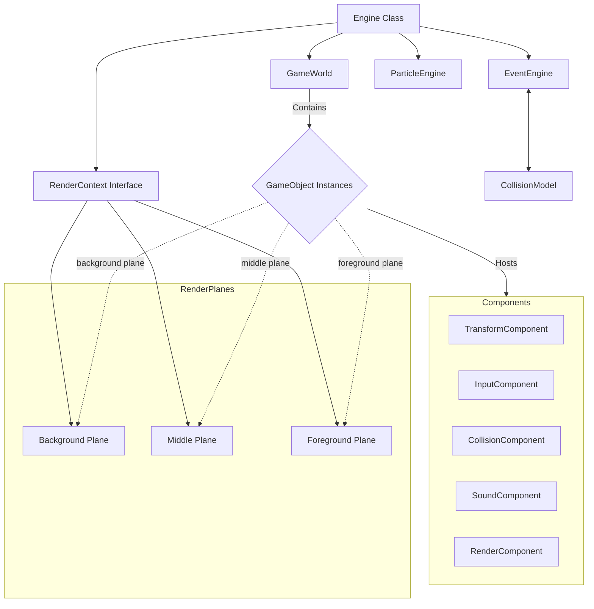

# Project Overview

RenderEngine4 is a lightweight 2D game engine built on fundamental principles of component-based architecture and simple rendering loops. It provides a flexible foundation for game development using plain JavaScript without external dependencies, featuring an event-driven system, world object management, collision detection infrastructure, particle effects support, and configurable render contexts optimized for different visualization needs (vector graphics, raster graphics). The engine emphasizes simplicity while maintaining extensibility through component composition and worker thread integration for background processing.

## Repository Structure

The root of the project is located at `C:\dev\RenderEngine4\`. The project structure is organized as follows:

- **`./spec`** – Core specification files defining engine architecture, features, and class contracts
- **`./src`** – Source code directory containing all implementation components
  - `./engine` – Engine core files and shared systems
    - `core/Engine.js` – Main engine loop and orchestration class
    - `core/EventEngine.js` – Event handling subsystem
    - `core/GameWorld.js` – World object container and update loop
    - `core/RenderEngineError.js` – Error handling for render operations
    - `rendercontexts/` – Base render context contract and concrete implementations
      - `RenderContext.js` – Base render context interface/contract
      - `Renderer.js` – Renderer base class
      - `contexts/VectorRenderContext.js` – Vector graphics implementation
      - `renderers/CanvasRenderer.js` – Canvas-based rendering
      - `renderers/WebGLRenderer.js` – WebGL-based rendering (placeholder)
    - `components/` – GameComponent base class and component implementations
      - `GameComponent.js` – Base game component class
      - `transform/` – Transform components
        - `TransformComponent.js` – Base transform component
        - `Transform2dComponent.js` – 2D transform implementation
        - `Mover2dComponent.js` – Movement component for 2D
      - `render/` – Rendering components
        - `RenderComponent.js` – Render component for context integration
      - `collision/` – Collision detection components
        - `ColliderComponent.js` – Base collider component
        - `AABBColliderComponent.js` – AABB collision implementation
        - `CABCColliderComponent.js` – CABD collision implementation
        - `ConvexHullColliderComponent.js` – Convex hull collision implementation
      - `input/` – Input handling components
        - `InputComponent.js` – Base input component
        - `KeyboardInputComponent.js` – Keyboard input handler
        - `MouseInputComponent.js` – Mouse input handler
      - `sound/` – Audio system components
        - `SoundComponent.js` – Sound playback component
        - `SpatialSoundComponent.js` – Spatial audio positioning component
    - `collisions/` – Collision model base class and algorithms
      - `CollisionModel.js` – Base collision model interface
      - `CollisionShape.js` – Collision shape abstraction
      - `models/` – Collision model implementations
        - `AABB.js` – Axis-aligned bounding box model
        - `CABC.js` – Convex approximated bounding capsule model
        - `ConvexHull.js` – Convex hull calculation model
    - `particlesystem/` – Particle system support modules
      - `ParticleEngine.js` – Particle engine orchestration
      - `ParticleEmitter.js` – Particle emitter base class
      - `ParticleEffect.js` – Particle effect base class
      - `effects/` – Pre-built particle effects
        - `Explosion.js` – Explosion effect implementation
        - `Spray.js` – Spray effect implementation
    - `gameobject/` – GameObject base class and related helpers
      - `GameObject.js` – Base game object class with component management
- **`./*`** – Agent configuration file for repository operations

## Build & Development Commands

The repository currently contains source files but does not include a `package.json` manifest or configured npm scripts.

- There is no defined top-level application entrypoint such as `index.html`.
- The engine source uses ES module syntax with exports in each module file.
- To run or package this project, add a `package.json` with `type: "module"` and appropriate scripts.

Example manual guidance:
- Open `index.html` or `debug.html` in a browser to test the engine.
- Add a top-level runtime entrypoint and package manifest before using npm commands.

## Code Style & Conventions

| Aspect | Convention |
|--------|------------|
| Language | Plain JavaScript (ES6+) |
| File Extension | `.js` |
| Naming | PascalCase for classes, camelCase for variables/functions |
| Indentation | 2 spaces |
| Line Length | ~100 characters |
| Class Design | Static helper patterns for world/engine systems; instance for objects |
| Comments | JSDoc style for public APIs |
| Error Handling | Try-catch with optional error logging to console |
| Module System | ES6 (`export default`) |

## Architecture Notes

**Data Flow:**  
`Engine` initializes → holds `GameWorld` (contains `GameObject`s) + `EventEngine` + `RenderContext` → Game loop: `Engine.update()` calls `GameWorld.update(time, delta)` which updates each `GameObject`'s components → `GameWorld.render()` iterates through `GameObject`s passing to `RenderContext.render()` for visibility checks and **plane-based sorting** → `RenderContext.sortObjectsByPlanes()` sorts objects by depth planes → each plane rendered in order (background → middle → foreground) → `RenderContext` outputs frame.

## Render Planes System

Render contexts support multi-plane rendering for depth-aware visualization:

### Default Configuration
- **3 planes**: Background, Middle, Foreground
- Objects are automatically assigned to planes based on world position z-coordinate
- Explicit plane assignment available via `assignObjectToPlane()`, `assignObjectToFront()`, `assignObjectToBack()`

### Usage Patterns
1. **UI Elements**: Assign to foreground plane
2. **Game Objects**: Auto-assigned or explicit middle plane
3. **Background Layers**: Assign to background plane for parallax effects
4. **Custom Parallax**: Configure multiple planes for layered backgrounds

### Key Methods
- `assignObjectToPlane(object, planeName)` – Explicit assignment
- `assignObjectToFront(object)` – Quick foreground assignment
- `assignObjectToBack(object)` – Quick background assignment
- `getObjectsInPlane(planeName)` – Query plane contents
- `sortObjectsByPlanes()` – Sort for depth-based rendering order
- `setPlaneConfiguration(count, names)` – Custom plane setup

## Testing Strategy

This repository does not currently expose an automated test harness or npm-based test scripts.

- No `package.json` means `npm test`, `npm run test:unit`, and related commands are not available yet.
- Existing source files can be validated by manual inspection and by adding a proper package manifest with a test framework.

**Test tools:**  
- **Unit:** Mocha/Chai may be added in future; currently manual execution via Node REPL or direct module import
- **Integration:** Scenario-based testing of full engine cycle (world → game objects → render context → plane sorting)
- **E2E:** Not applicable for pure engine (requires DOM/render targets)

## Security & Compliance

- **No external dependencies** reduces supply-chain attack surface
- **Worker threads** use Node.js built-in module with worker data size limits
- **Secrets:** No hardcoded credentials; all configuration via environment variables
- **Dependencies:** Manual audit recommended before deployment (`npm audit`)
- **License:** Open-source friendly (MIT-compatible patterns in mind); see `LICENSE` if present

## Agent Guardrails

**Never touch these files without explicit approval:**  
- `/spec/**` – Specifications are contracts; modifications break architectural agreements
- `/AGENTS.md` – Agent configuration itself
- Any file with `.min.js` or `vendor/` paths (if added in future)

**Required reviews before modification:**  
- All changes to `/src/engine/*` must verify event engine compatibility
- **Changes to render contexts require updating base class and both vector/raster implementations together**
- Worker thread implementation needs performance benchmarking approval
- **Render plane modifications must preserve backward compatibility with objects without explicit plane assignments**

**Rate limits:**  
- Batch operations limit: 100 GameObject updates per batch for profiling accuracy
- Render loop caps at 60 FPS default; configurable via `Engine.maxFramesPerSecond`

## Extensibility Hooks

| Hook | Description | Default | Env Var |
|------|-------------|---------|---------|
| `maxPlanes` | Number of render planes to support | 3 | `RENDER_PLANES` |
| `workerThreadsEnabled` | Use Web Workers for collision/physics | true | `ENABLE_WORKERS` |
| `renderContextType` | Default context type ('vector' or 'raster') | 'raster' | `CONTEXT_TYPE` |
| `enableCulling` | Culling optimization flag | true | `ENABLE_CULLING` |

**Feature flags:**  
- `FUTURE_WEBGL_SUPPORT` (disabled by default)
- `OCTREE_COLLISION_MODEL` (experimental, disabled)

## Performance Considerations

### Render Planes
- Plane sorting adds minimal overhead (linear time O(n))
- Background planes should be optimized for large object counts
- Foreground planes typically have fewer high-priority objects

### Auto-Assignment Heuristics
Default auto-assignment based on z-coordinate thresholds:
- `z < -100`: Background plane
- `-100 <= z <= 100`: Middle plane  
- `z > 100`: Foreground plane

These thresholds can be adjusted by customizing subclass implementations.

## Further Reading

- [`/spec/engine/spec.md`](./spec/engine/spec.md) – Engine architecture and core features
- [`/spec/rendercontexts/spec.md`](./spec/rendercontexts/spec.md) – Render context interface and plane-based sorting flows
- [`/spec/gameobject/spec.md`](./spec/gameobject/spec.md) – GameObject class and component management
- [`/spec/components/spec.md`](./spec/components/spec.md) – GameComponent class and subclass definitions
- [`/spec/particlesystem/spec.md`](./spec/particlesystem/spec.md) – Particle system implementation
- [`/spec/collisions/spec.md`](./spec/collisions/spec.md) – Collision detection and response

