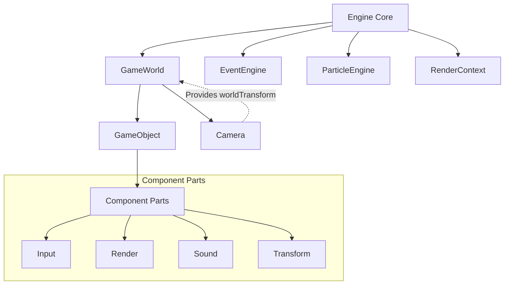

# Architecture Overview

This diagram provides a high-level overview of the RenderEngine4 architecture, focusing on the core structural components.

```mermaid
graph TD
    Engine[Engine Core] --> GameWorld[GameWorld]
    Engine --> EventEngine[EventEngine]
    Engine --> ParticleEngine[ParticleEngine]
    Engine --> RenderContext[RenderContext]

    GameWorld --> GameObject[GameObject]
    GameWorld --> Camera[Camera]
    
    GameObject --> ComponentParts[Component Parts]
    
    subgraph "Component Parts"
        ComponentParts --> Input[Input]
        ComponentParts --> Render[Render]
        ComponentParts --> Sound[Sound]
        ComponentParts --> Transform[Transform]
    end

    Camera -.->|Provides worldTransform| GameWorld
```
